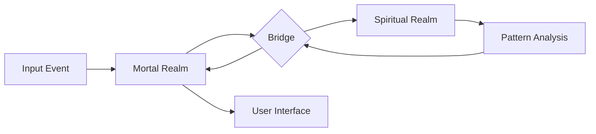
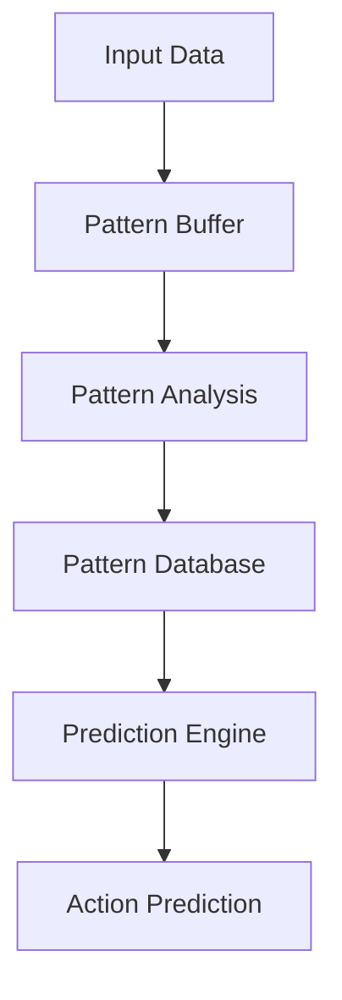
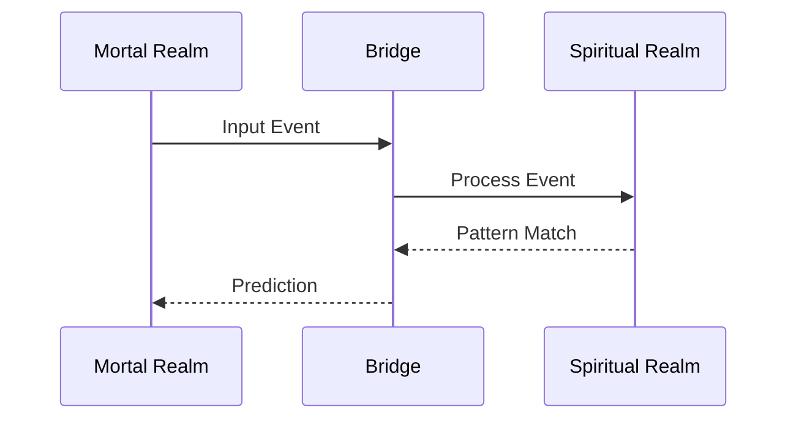

# ABIKA Architecture Documentation

## Dual-Realm Architecture

### Overview
ABIKA uses a dual-realm architecture to optimize both development speed and performance. The system is split into two main realms:

1. **Mortal Realm (Python)**
   - User interface and system integration
   - Configuration and management
   - High-level logic

2. **Spiritual Realm (C++)**
   - Performance-critical operations
   - Pattern recognition and analysis
   - Real-time processing

### Communication Bridge
The realms communicate through a high-performance bridge using:
- ZeroMQ for message passing
- Shared memory for large datasets
- Lock-free queues for high-frequency events

## Component Architecture

### Mortal Realm Components

#### 1. Core System
```python
mortal/src/core/
├── config.py      # Configuration management
├── system.py      # Core system functionality
└── bridge.py      # Bridge interface
```

#### 2. Input Monitoring
```python
mortal/src/monitor/
├── input.py       # Input capture
├── context.py     # Context awareness
└── privacy.py     # Privacy controls
```

#### 3. User Interface
```python
mortal/src/interface/
├── tray.py        # System tray
├── settings.py    # Settings window
└── notifications.py # User notifications
```

#### 4. Utilities
```python
mortal/src/utils/
├── logger.py      # Logging system
└── security.py    # Security utilities
```

### Spiritual Realm Components

#### 1. Core Engine
```cpp
spiritual/src/core/
├── engine.hpp     // Main processing engine
├── patterns.hpp   // Pattern management
└── predict.hpp    // Prediction engine
```

#### 2. Bridge Implementation
```cpp
spiritual/src/bridge/
├── protocol.hpp   // Communication protocol
├── memory.hpp     // Shared memory management
└── queue.hpp      // Lock-free queues
```

#### 3. Analysis
```cpp
spiritual/src/analysis/
├── patterns.hpp   // Pattern recognition
├── predict.hpp    // Prediction algorithms
└── learn.hpp      // Learning system
```

## Data Flow

### 1. Input Processing


### 2. Pattern Recognition


### 3. Bridge Communication


## Memory Management

### Shared Memory Layout
```
+------------------+
| Command Channel  |
+------------------+
| Event Channel    |
+------------------+
| Pattern Buffer   |
+------------------+
| Shared Data Pool |
+------------------+
```

### Resource Management
1. **Memory Pools**
   - Fixed-size allocations
   - Pre-allocated buffers
   - Zero-copy transfers

2. **Thread Management**
   - Thread pools
   - Work stealing
   - Load balancing

## Security Architecture

### 1. Authentication
- Face recognition
- Password backup
- Session management

### 2. Privacy
- Local processing
- Data encryption
- Secure storage

### 3. Access Control
- Resource limits
- Capability model
- Audit logging

## Performance Considerations

### 1. Bridge Performance
- Message batching
- Zero-copy transfers
- Lock-free algorithms
- Shared memory usage

### 2. Pattern Recognition
- Parallel processing
- GPU acceleration
- Memory optimization
- Cache efficiency

### 3. Real-time Processing
- Event prioritization
- Predictive caching
- Load balancing
- Resource management

## Development Guidelines

### 1. Mortal Realm
- Type hints required
- Async/await preferred
- Error handling required
- Documentation required

### 2. Spiritual Realm
- RAII principles
- Move semantics
- Exception safety
- Performance focus

### 3. Bridge Protocol
- Version control
- Backward compatibility
- Error recovery
- Performance monitoring

## Testing Architecture

### 1. Unit Tests
- Component isolation
- Mock interfaces
- Performance tests
- Coverage requirements

### 2. Integration Tests
- Bridge testing
- System testing
- Performance testing
- Load testing

## Deployment Architecture

### 1. Package Structure
```
abika/
├── bin/
│   ├── abika-mortal
│   └── abika-spiritual
├── lib/
│   ├── libabika-core.so
│   └── libabika-bridge.so
└── share/
    └── abika/
```

### 2. Configuration
```
~/.config/abika/
├── config.json
├── patterns/
└── security/
```

### 3. Data Storage
```
~/.local/share/abika/
├── patterns/
├── logs/
└── cache/
```

## Extension Architecture

### 1. Plugin System
- Dynamic loading
- Sandboxing
- API versioning
- Resource management

### 2. API Design
- Stable interfaces
- Version control
- Documentation
- Examples

This architecture document serves as a reference for development and maintenance of the ABIKA system. It should be updated as the system evolves.
