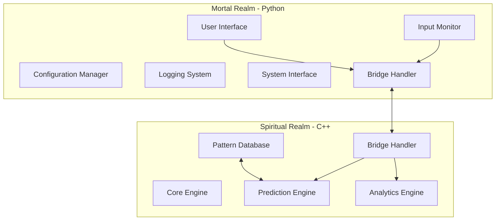
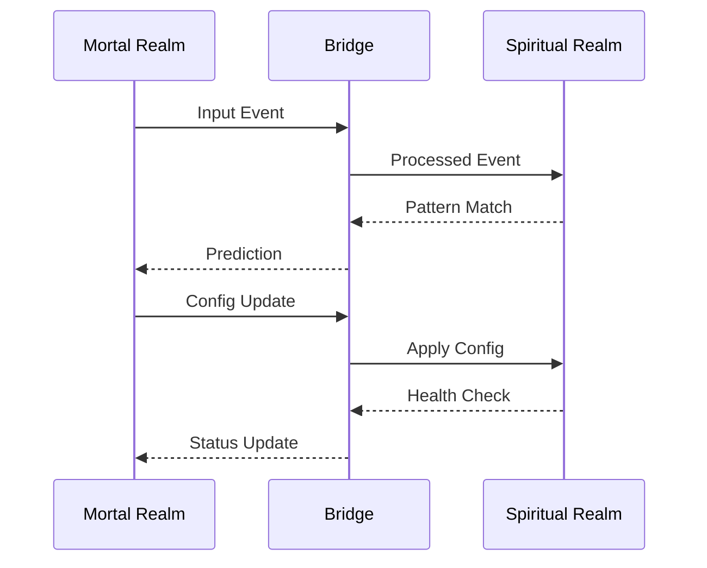

# ABIKA Dual-Realm Architecture

## 1. Architectural Overview

### Mortal Realm (Python)


### Component Responsibilities

#### Mortal Realm (Python)
1. **User Interface**
   - System tray presence
   - Settings interface
   - Notifications
   - Status display

2. **Configuration Manager**
   - Settings management
   - User preferences
   - System state

3. **Input Monitor**
   - Keyboard/Mouse tracking
   - System event monitoring
   - Context awareness

4. **System Interface**
   - OS integration
   - File system operations
   - Process management

#### Spiritual Realm (C++)
1. **Core Engine**
   - Pattern processing
   - Real-time analysis
   - Decision making

2. **Pattern Database**
   - Pattern storage
   - Quick retrieval
   - Pattern optimization

3. **Prediction Engine**
   - Behavior prediction
   - Pattern matching
   - Confidence calculation

## 2. Communication Protocol

### Message Types

```json
{
    "standard_messages": {
        "pattern_update": {
            "type": "pattern",
            "action": "update",
            "data": {
                "pattern_id": "string",
                "confidence": "float",
                "context": "object"
            }
        },
        "prediction_request": {
            "type": "prediction",
            "action": "request",
            "data": {
                "context": "object",
                "threshold": "float"
            }
        },
        "system_event": {
            "type": "event",
            "action": "notify",
            "data": {
                "event_type": "string",
                "payload": "object"
            }
        }
    },
    "control_messages": {
        "health_check": {
            "type": "system",
            "action": "health_check"
        },
        "shutdown": {
            "type": "system",
            "action": "shutdown"
        }
    }
}
```

### Communication Channels

1. **ZeroMQ Sockets**
   - Command Channel (REQ/REP)
   - Event Channel (PUB/SUB)
   - Data Channel (PUSH/PULL)

2. **Shared Memory**
   - Large dataset transfer
   - Real-time pattern data
   - Performance metrics

### Protocol Flow


## 4. Spiritual Realm Language Analysis

### C++ Advantages
1. **Performance**
   - Direct memory management
   - Efficient computation
   - Hardware optimization

2. **Library Support**
   - Mature ML libraries (dlib, mlpack)
   - System integration
   - Threading libraries

3. **Tool Integration**
   - Qt6 compatibility
   - Easy Python binding (pybind11)
   - Build system support

4. **Development**
   - Familiar syntax
   - Large community
   - Extensive documentation

### Rust Advantages
1. **Safety**
   - Memory safety
   - Thread safety
   - No undefined behavior

2. **Modern Features**
   - Zero-cost abstractions
   - Pattern matching
   - Async support

3. **Performance**
   - On par with C++
   - Predictable optimization
   - Clean concurrency

4. **Development**
   - Modern tooling
   - Package management
   - Growing community

### Recommendation: C++
Reasons:
1. Your existing experience
2. Qt6 familiarity
3. Mature ecosystem
4. Easier integration with Python
5. More ML/AI libraries
6. Better tooling support

The transition will be smoother with C++, and we can focus on the architecture rather than learning a new language. C++ also provides all the performance benefits we need for the Spiritual Realm.
